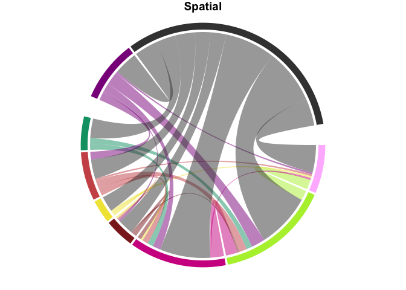

test_markdown
================
Veronica
2024-03-08

## R Markdown

This is an R Markdown document. Markdown is a simple formatting syntax
for authoring HTML, PDF, and MS Word documents. For more details on
using R Markdown see <http://rmarkdown.rstudio.com>.

When you click the **Knit** button a document will be generated that
includes both content as well as the output of any embedded R code
chunks within the document. You can embed an R code chunk like this:

``` r
setwd("~/Desktop/Review")
#Make descision tree
ref_data <- read.csv("rayyan_references_included_chords2.csv", header = TRUE)

###Associations plots
library(tidyverse)
```

    ## ── Attaching core tidyverse packages ─────────────────── tidyverse 2.0.0.9000 ──
    ## ✔ dplyr     1.1.2     ✔ readr     2.1.4
    ## ✔ forcats   1.0.0     ✔ stringr   1.5.0
    ## ✔ ggplot2   3.4.2     ✔ tibble    3.2.1
    ## ✔ lubridate 1.9.2     ✔ tidyr     1.3.0
    ## ✔ purrr     1.0.1     
    ## ── Conflicts ────────────────────────────────────────── tidyverse_conflicts() ──
    ## ✖ dplyr::filter() masks stats::filter()
    ## ✖ dplyr::lag()    masks stats::lag()
    ## ℹ Use the conflicted package (<http://conflicted.r-lib.org/>) to force all conflicts to become errors

``` r
df<- read.csv("articles.csv", header = TRUE)
df<-df %>% 
  filter(str_detect(Category, pattern = "nogap",negate=TRUE))

############## SMALL SPATIAL SCALES ONLY ##############
dfs<-df %>% 
  filter(str_detect(Category, pattern = "J"))
#Spatial = S, Community = C, Genetic = G
# Small-scale = J, Big = K

#Get spatial gap matrix
spatial1<-dfs %>% 
  filter(str_detect(Category, pattern = "S") & !str_detect(Category, pattern = "G"))
out_spatial1 <- crossprod(table(subset(stack(setNames(lapply(strsplit(spatial1$Category, 
                                                                      "[][]|,\\s*"), trimws), spatial1$Id))[2:1], nzchar(values))))
diag(out_spatial1) <- 0
#remove U and M category (misc. and unknown
out_spatial1 <- out_spatial1[, !colnames(out_spatial1) %in% c("U","M")] 
out_spatial1 <- out_spatial1[!rownames(out_spatial1) %in% c("U","M"),]

#Arrange 
custom_order<-c("V","O","H","I","E","B","T","C","S")
out_spatial1 <- out_spatial1[custom_order, custom_order]
cols <- c(B = "indianred3", C = "darkmagenta", E = "#F0E442",
          "F" = "#6EE2FF", G = "darkblue",
          H = "violetred", I = "brown4",
          L = "royalblue3",M = "yellow4",
          O = "olivedrab2",S = "gray25",
          Sx = "lightsalmon","T" = "#009E73",
          U = "tan",V = "plum1",W = "chocolate1")

library(circlize)
```

    ## ========================================
    ## circlize version 0.4.16
    ## CRAN page: https://cran.r-project.org/package=circlize
    ## Github page: https://github.com/jokergoo/circlize
    ## Documentation: https://jokergoo.github.io/circlize_book/book/
    ## 
    ## If you use it in published research, please cite:
    ## Gu, Z. circlize implements and enhances circular visualization
    ##   in R. Bioinformatics 2014.
    ## 
    ## This message can be suppressed by:
    ##   suppressPackageStartupMessages(library(circlize))
    ## ========================================

``` r
#Make plots
circos.clear()
#add groups for spacing
group <- c(V = "A", O = "A", H = "A", I = "A", E = "A", L = "A",
           B = "A", "T" = "A", Sx = "A", "F" = "A",W="A",G = "B", C = "B",S = "B")

out_spatial1[upper.tri(out_spatial1)] <- NA

p<-chordDiagram(out_spatial1,grid.col = cols,annotationTrack = "grid",group=group, big.gap = 10) 
title("Spatial")
```

<!-- -->

``` r
#cols2 <- c("plum1","olivedrab2","violetred","borwn4","royalblue3","indianred3","#009E73","lightsalmon","#6EE2FF","chocolate1","gray25","darkblue","darkmagenta","green")


#Make interactive
library(chorddiag)
library(htmlwidgets)
library(gdata)
```

    ## 
    ## Attaching package: 'gdata'
    ## 
    ## The following objects are masked from 'package:dplyr':
    ## 
    ##     combine, first, last, starts_with
    ## 
    ## The following object is masked from 'package:purrr':
    ## 
    ##     keep
    ## 
    ## The following object is masked from 'package:tidyr':
    ## 
    ##     starts_with
    ## 
    ## The following object is masked from 'package:stats':
    ## 
    ##     nobs
    ## 
    ## The following object is masked from 'package:utils':
    ## 
    ##     object.size
    ## 
    ## The following object is masked from 'package:base':
    ## 
    ##     startsWith

``` r
cols <- c(B = "indianred3", C = "darkmagenta", E = "#F0E442",
          "F" = "#6EE2FF", G = "darkblue",
          H = "violetred", I = "brown4",
          L = "royalblue3",M = "yellow4",
          O = "olivedrab2",S = "gray25",
          Sx = "lightsalmon","T" = "#009E73",
          U = "tan",V = "plum1",W = "chocolate1")


#add white columns that are blank to spatially separate diagram
cols2 <- c("#FFBBFF","#B3EE3A","#D02090","#8B2323", "#F0E442","#CD5555", "#009E73","white","white","white","white","white","white","#8B008B","#404040","white","white","white","white","white","white")
upperTriangle(out_spatial1) = lowerTriangle(out_spatial1, byrow=TRUE)
#p <- chorddiag(out_spatial,grid.col = cols,annotationTrack = "grid",group=group, big.gap = 10)

ad <- c(0,0,0,0,0,0,0,0,0,0,0,0,0,0,0)
out_spatial2 = cbind(out_spatial1[,c(1:7)],ad,ad,ad,ad,ad,ad,out_spatial1[,c(8:9)],ad,ad,ad,ad,ad,ad)
```

    ## Warning in cbind(out_spatial1[, c(1:7)], ad, ad, ad, ad, ad, ad, out_spatial1[,
    ## : number of rows of result is not a multiple of vector length (arg 2)

``` r
out_spatial2 = rbind(out_spatial2[c(1:7),],ad,ad,ad,ad,ad,ad,out_spatial2[c(8:9),],ad,ad,ad,ad,ad,ad)
```

    ## Warning in rbind(out_spatial2[c(1:7), ], ad, ad, ad, ad, ad, ad,
    ## out_spatial2[c(8:9), : number of columns of result is not a multiple of vector
    ## length (arg 2)

## Including Plots

You can also embed plots, for example:

``` r
p <- chorddiag(out_spatial2, groupColors = cols2, showGroupnames = FALSE,groupPadding = 2,showTooltips = FALSE,tickInterval=10,ticklabelFontsize=0)
p
```

<div class="chorddiag html-widget html-fill-item-overflow-hidden html-fill-item" id="htmlwidget-0e81a17cf9add7b5b278" style="width:672px;height:480px;"></div>
<script type="application/json" data-for="htmlwidget-0e81a17cf9add7b5b278">{"x":{"matrix":[[0,5,1,0,1,1,0,0,0,0,0,0,0,1,14,0,0,0,0,0,0],[5,0,6,1,0,4,3,0,0,0,0,0,0,7,28,0,0,0,0,0,0],[1,6,0,2,1,3,3,0,0,0,0,0,0,4,26,0,0,0,0,0,0],[0,1,2,0,1,1,0,0,0,0,0,0,0,1,8,0,0,0,0,0,0],[1,0,1,1,0,0,0,0,0,0,0,0,0,0,8,0,0,0,0,0,0],[1,4,3,1,0,0,0,0,0,0,0,0,0,4,10,0,0,0,0,0,0],[0,3,3,0,0,0,0,0,0,0,0,0,0,0,10,0,0,0,0,0,0],[0,0,0,0,0,0,0,0,0,0,0,0,0,0,0,0,0,0,0,0,0],[0,0,0,0,0,0,0,0,0,0,0,0,0,0,0,0,0,0,0,0,0],[0,0,0,0,0,0,0,0,0,0,0,0,0,0,0,0,0,0,0,0,0],[0,0,0,0,0,0,0,0,0,0,0,0,0,0,0,0,0,0,0,0,0],[0,0,0,0,0,0,0,0,0,0,0,0,0,0,0,0,0,0,0,0,0],[0,0,0,0,0,0,0,0,0,0,0,0,0,0,0,0,0,0,0,0,0],[1,7,4,1,0,4,0,0,0,0,0,0,0,0,12,0,0,0,0,0,0],[14,28,26,8,8,10,10,0,0,0,0,0,0,12,0,0,0,0,0,0,0],[0,0,0,0,0,0,0,0,0,0,0,0,0,0,0,0,0,0,0,0,0],[0,0,0,0,0,0,0,0,0,0,0,0,0,0,0,0,0,0,0,0,0],[0,0,0,0,0,0,0,0,0,0,0,0,0,0,0,0,0,0,0,0,0],[0,0,0,0,0,0,0,0,0,0,0,0,0,0,0,0,0,0,0,0,0],[0,0,0,0,0,0,0,0,0,0,0,0,0,0,0,0,0,0,0,0,0],[0,0,0,0,0,0,0,0,0,0,0,0,0,0,0,0,0,0,0,0,0]],"options":{"type":"directional","width":null,"height":null,"margin":100,"showGroupnames":false,"groupNames":["V","O","H","I","E","B","T","ad","ad","ad","ad","ad","ad","C","S","ad","ad","ad","ad","ad","ad"],"groupColors":["#FFBBFF","#B3EE3A","#D02090","#8B2323","#F0E442","#CD5555","#009E73","white","white","white","white","white","white","#8B008B","#404040","white","white","white","white","white","white"],"groupThickness":0.1,"groupPadding":0.0349065850398866,"groupnamePadding":[30,30,30,30,30,30,30,30,30,30,30,30,30,30,30,30,30,30,30,30,30],"groupnameFontsize":18,"groupedgeColor":null,"chordedgeColor":"#808080","categoryNames":null,"categorynamePadding":100,"categorynameFontsize":28,"showTicks":true,"tickInterval":10,"ticklabelFontsize":0,"fadeLevel":0.1,"showTooltips":false,"showZeroTooltips":true,"tooltipNames":["V","O","H","I","E","B","T","ad","ad","ad","ad","ad","ad","C","S","ad","ad","ad","ad","ad","ad"],"tooltipFontsize":12,"tooltipUnit":"","tooltipGroupConnector":" &#x25B6; ","precision":"null","clickAction":null,"clickGroupAction":null}},"evals":[],"jsHooks":[]}</script>

``` r
#setwd("/Users/veronicapagowski/Desktop/interactive_app/interactive_review")
#saveWidget(p, "chord_test.html", selfcontained = TRUE, knitrOptions = list())

htmltools::tags$iframe(src="/Users/veronicapagowski/Desktop/interactive_app/interactive_review/chord_test.html",
    width="100%", 
    height="400",
    scrolling="no", 
    seamless="seamless", 
    frameBorder="0")
```

<iframe src="/Users/veronicapagowski/Desktop/interactive_app/interactive_review/chord_test.html" width="100%" height="400" scrolling="no" seamless="seamless" frameBorder="0"></iframe>

Note that the `echo = FALSE` parameter was added to the code chunk to
prevent printing of the R code that generated the plot.
